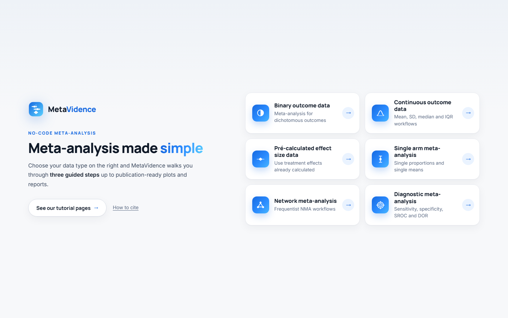
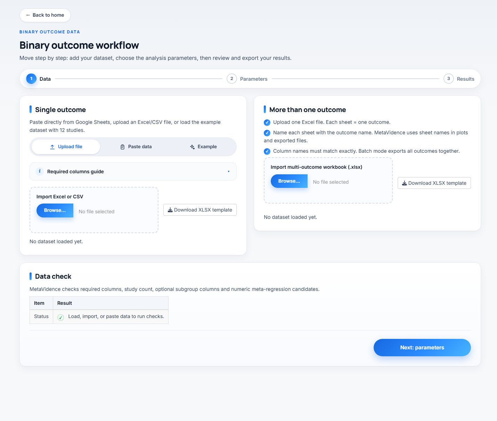
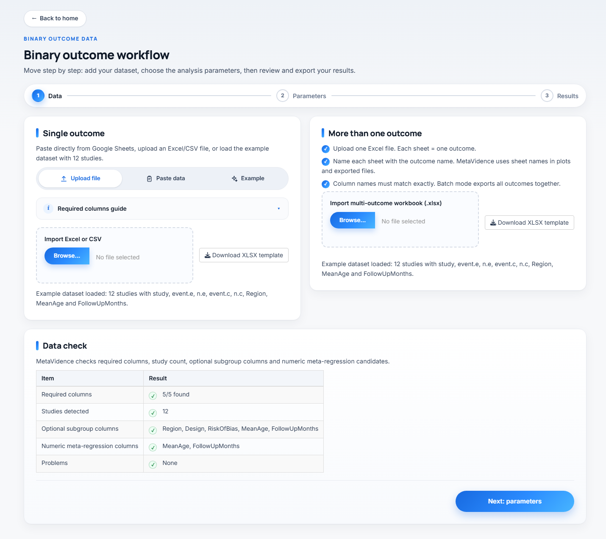
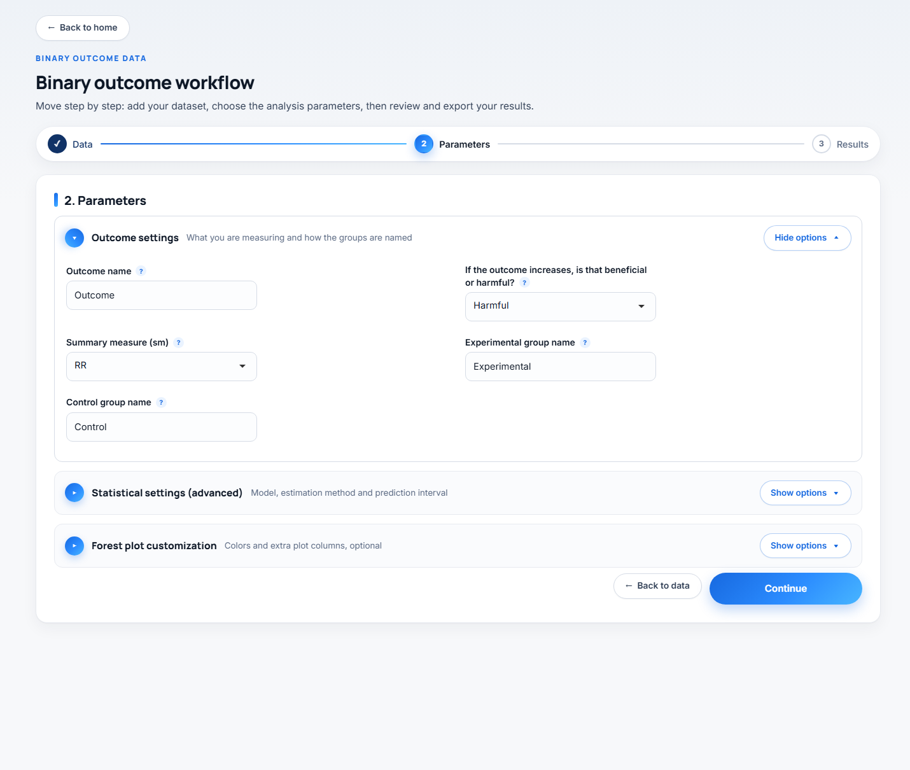
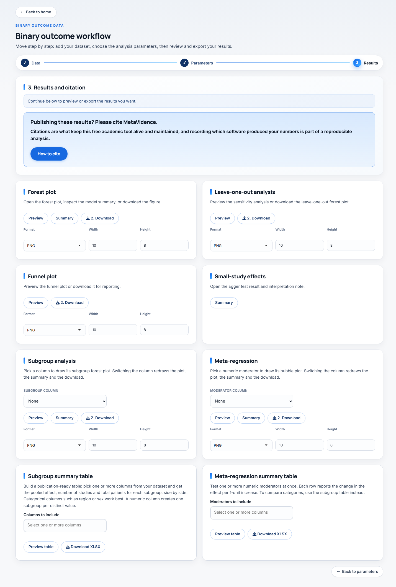
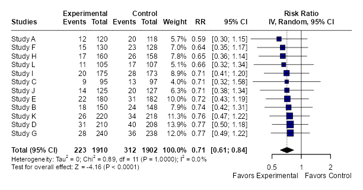
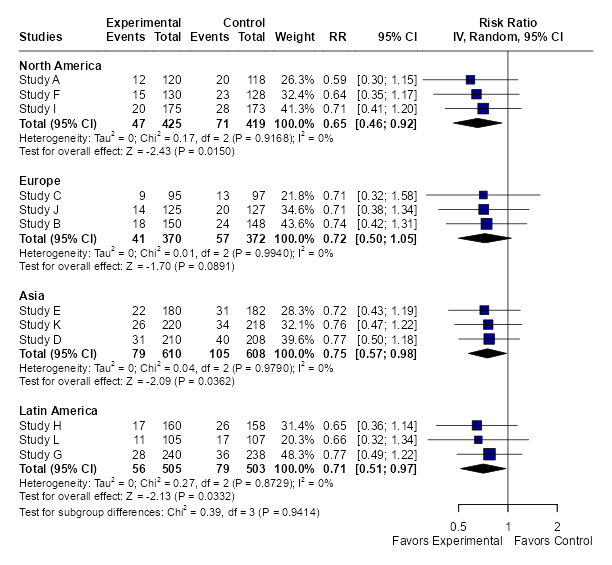
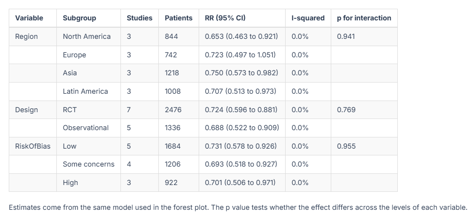

Every MetaVidence module follows the same sequence, always in the same order:
load the data, choose the parameters, review and export the results.

This page walks that whole flow, screen by screen. The images come from the
binary outcomes module, but what is described here applies to all of them. Each
module page covers only what changes in it.

## The starting point

On the home page, click the card for the kind of data you have. The table on the
[tutorials home page](index.qmd) says which module suits each format.

## Step 1, the data

You have three routes, in the tabs of the card on the left:

* **Upload file** takes an Excel or CSV file. The button to download the
  spreadsheet template sits next to it, already with the right column names.
* **Paste data** pastes straight from Google Sheets or Excel.
* **Example** loads 12 fictional studies, so you can explore the app without
  preparing anything.

### The required columns

The collapsible guide just below the tabs lists what the spreadsheet needs, with
the exact column names for that module. Each module page carries the same list.

Any extra column is optional. Text columns become available for subgroup
analysis, numeric ones for meta-regression. The example datasets carry `Region`,
`Design`, `RiskOfBias`, `MeanAge` and `FollowUpMonths`.

### The data check

As soon as the data comes in, the **Data check** card reports back: whether all
required columns are there, how many studies were detected, which columns are
left for subgroup and meta-regression, and whether there are problems, such as
blank cells, events larger than the total or sample sizes of zero.

It is worth reading before moving on. Fixing the spreadsheet now is faster than
finding the error halfway through the analysis.

When everything checks out, click **Next: parameters**.

## Step 2, the parameters

The fields come in two sections. **Outcome settings** opens by default, because
it is the one you almost always touch. **Statistical settings (advanced)**
starts collapsed, because the defaults suit most cases.

Every field has a "?" next to it carrying a summary of the explanation inside the
app.

### Outcome settings

**Outcome name** (default `Outcome`) goes into plot titles and exported file
names. It is worth replacing with something short and specific, such as
`30-day mortality`, because that is how the file will reach your computer.

**If the outcome increases, is that beneficial or harmful?** (default `Harmful`)
only sets the "Favors experimental" and "Favors control" labels under the forest
plot. It changes no numbers. Choose `Harmful` for bad outcomes, such as death,
and `Beneficial` for good ones, such as cure.

**Experimental group name** and **Control group name** set how the groups appear
in the plots. Replacing them with real names, such as `Anticoagulant` and
`Placebo`, leaves the figure ready for publication.

**Summary measure (sm)** decides what gets pooled, and the options change from
module to module. It is the most important choice on this screen, so it is
explained on each module page.

Single-arm has no direction and no group names, because there is no comparison.
Network has two fields of its own here, and diagnostic accuracy has almost
nothing. See the module page.

### Statistical settings (advanced) {#statistical-settings-advanced}

These fields are the same in most modules, with the same defaults.

**Analysis model** (default `Random-effects`).

* `Random-effects` lets the true effect vary between studies.
* `Fixed-effect` assumes every study estimates exactly the same effect.
* `Both` draws the two lines on the same forest plot.

**Tau method** (default `REML`) is the estimator of the between-study variance,
τ², which drives the random-effects weights, I² and the prediction interval.
`REML` is restricted maximum likelihood, `ML` maximum likelihood, `DL` the
DerSimonian-Laird estimator, and `PM`, `SJ`, `HE`, `HS` and `EB` the remaining
estimators implemented in `meta`.

**I-squared method** (default `Q`) decides how I² is computed. `Q` uses the
Higgins and Thompson definition, I² = (Q − df)/Q. `From tau-squared` derives it
from the estimated τ² instead. The two answer different questions and can differ
substantially on the same data: on the same four studies we get 89.9% with `Q`
and 97.2% with τ².

**Prediction interval** adds the range where the effect of a future study is
expected to fall. It needs at least 3 studies, and with 3 or 4 the interval comes
out very wide. The default varies by module.

**Random CI method** (default `classic`) sets how the confidence interval of the
pooled effect is computed under the random-effects model.

* `classic` uses the normal approximation.
* `HK`, Hartung-Knapp, uses the t distribution, which usually widens the
  interval.
* `KR`, Kenward-Roger, follows the same idea with a variance adjustment.

**Prediction method** (default `V`) sets how the prediction interval is
computed. `V` uses the t distribution with k-1 degrees of freedom and `HTS` uses
t with k-2.

**Method**, the pooling method, exists only in the binary and single-proportion
modules, with different options in each. See the module page.

### Subgroup and meta-regression

These two columns are not chosen here. In single-outcome analysis and in
[batch mode](multiple-outcomes.qmd) alike, you pick them in step 3, inside the
result card itself, and the analysis is re-run for the column you choose.

When you are ready, click **Run analysis**.

## Step 3, export and results

The **3. Results and citation** card at the top carries the analysis status and
the citation reminder. Below it comes the results grid.

Each result has its own card. Most carry **Preview** to see it on screen,
**Summary** for the numeric output and **Download** to save. A few cards have no
preview, and there the button reads **Download plot** so it cannot be mistaken for
the summary. Format, width and height sit in each card: PNG exports at 600 DPI and
PDF exports as vector, both suitable for submission.

::: {.callout-tip}
## Plot came out clipped?
Increase the height on the card itself and download again. That fixes almost
every clipping case, because the plot area is shared between the study rows and
the footer with the statistics.
:::

::: {.callout-important}
## Download before you leave
Do not reload or close the tab while you still have a result you have not
downloaded. The app keeps everything in the memory of the session: reloading
starts a new one, and the loaded data and the results are gone. There is no way
to get them back without running the analysis again.
:::

Not every module carries all the cards below. Network and diagnostic accuracy
have sets of their own, described on their pages.

### Forest plot

The main plot. Each study with its effect and confidence interval, the weight it
received, and the diamond of the pooled effect at the bottom. Below it come the
heterogeneity statistics (τ², Q, I²) and the test of the overall effect.

### Leave-one-out analysis

Redoes the pooling dropping one study at a time, and plots the result of each
round. It answers whether a single study is holding up the conclusion. If the
estimate barely moves, the result is robust. If one study flips the direction or
the significance, that belongs in the paper.

### Funnel plot

The funnel plot, effect against precision. Asymmetry suggests publication bias,
but it can also come from real heterogeneity or from small studies of differing
quality. Interpret with caution below 10 studies.

### Small-study effects

This card has only the **Summary** button, and it opens the Egger test result
with an interpretation note. It is the formal test for the asymmetry you saw in
the funnel.

### Subgroup analysis

Pick a column in the selector inside the card and the plot is redrawn
immediately. There is no need to go back to step 2 or rerun the analysis.

The overall pooled effect does not change when you ask for subgroups. The same
analysis is rerun with the same parameters, only partitioned. What you gain is
the effect within each level and the test for subgroup differences at the
bottom.

### Meta-regression

Pick a numeric moderator and the app draws the bubble plot, with each bubble
sized by the study weight, and the fitted line. **Summary** gives the
coefficient, the interval, the p value and the model R².

The selector lists numeric columns only, such as `MeanAge` or `FollowUpMonths`.
Categorical moderators belong in the subgroup analysis, not in this card.

::: {.callout-warning}
## Meta-regression needs studies
A common rule of thumb is at least 10 studies per moderator. Below that the
coefficient is unstable and the line looks more convincing than it is.
:::

### Subgroup summary table and Meta-regression summary table

Here you select several columns at once and get a single table. The subgroup one
gives the effect per level, the number of studies, I² and the interaction p
value for each variable. The meta-regression one gives the coefficients of each
numeric moderator. These are the tables that usually go into the paper, and both
export as XLSX.

